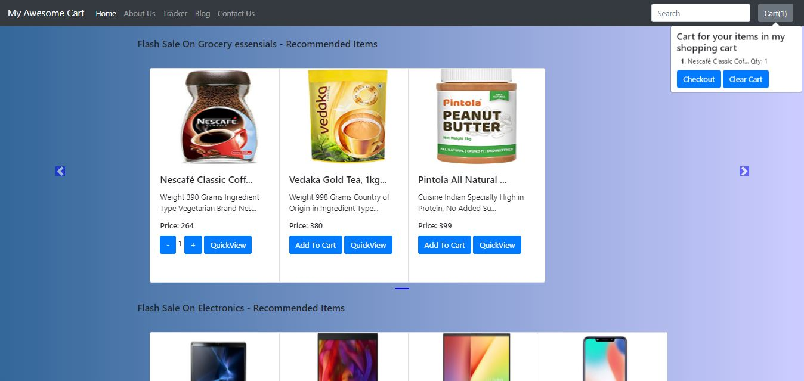
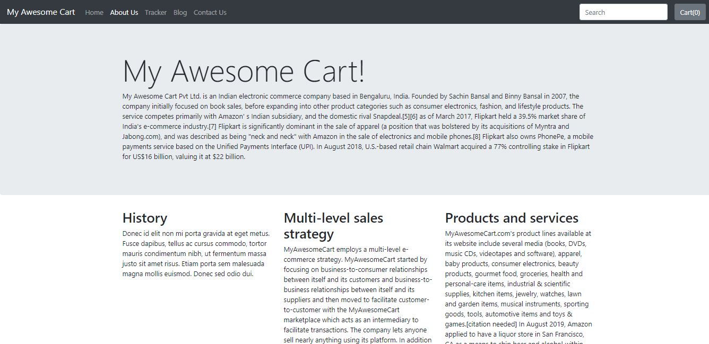
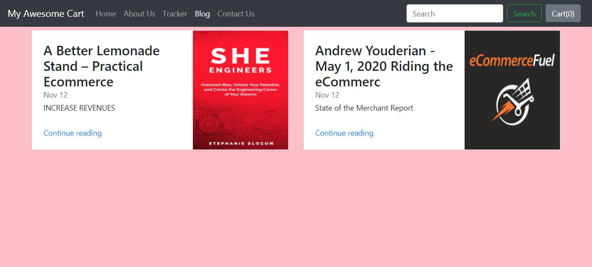
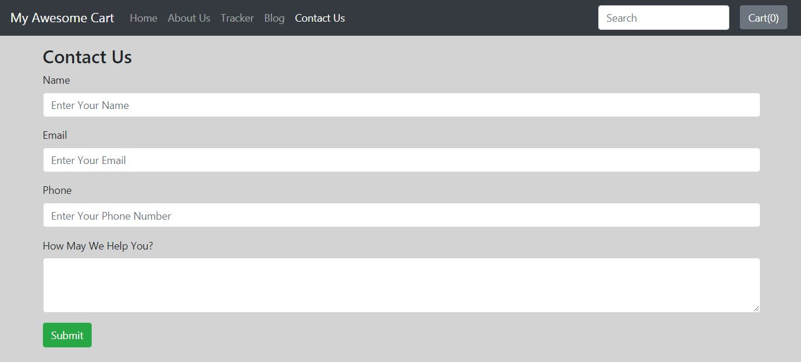
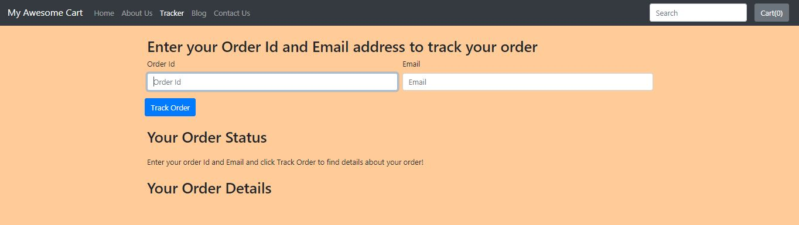

# E-Commerce-Website
This website will help you while online shopping. You can search the products, order the product, track the location of product, see blogs available and can ask query. It's a secure website and no need to share any data while looking for the products. Information would be required while checkout.

## To run locally

1. Python 3
2. install dependency: \
     `pip install django==3.0`
3. move in your project folder and run the commands given below:\
     `python manage.py makemigrations`\
     `python manage.py migrate`\
     `python manage.py runserver`

     ## Screenshots of Web Application

     <table align="center">
     <tr>
         <td>
        			Homepage
         </td>
          <td>
          		AboutUs
          </td>
     </tr>
     <tr>
          <td>
              
          	</td>
          	<td>
              
          	</td>
     </tr>
     <tr>
           <td>
          		  Blogs
          	</td>
          	<td>
          			ContactUs
          	</td>
     </tr>
     <tr>
          	<td>
          	</td>
          	<td>
          	</td>
     </tr>
     <tr>
           <td>
              Tracker
           </td>
     </tr>
     <tr>
          <td>
          </td>
     </tr>

     </table>
